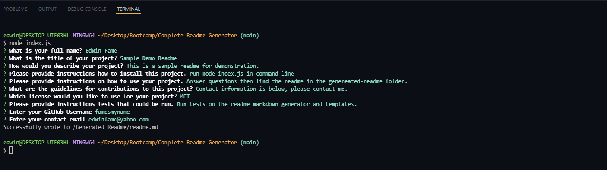

# Complete Readme Generator
  
  ## Description
  
  This app was created to generate high quality readme markdown files. It is useful as a quick way to generate a complete readme quickly or to use as a starting point without having to create a readme and its sections from scratch.

  ---
  ## Table of Contents 
  
  - [Installation](#installation)
  - [Usage](#usage)
  - [License](#license)
  - [Contributions](#contributions)
  - [Test](#test)
  - [Questions](#questions)

  ---
  ## Installation
  To install the project simply download the project from and open a commmand line interface of your choice. Run the app with by typing npm start(if npm is installed) or node index.js into the commind line.

  ---
  ## Usage
  Once the app has started, the user will be immediately asked a series of questions in order to populate the soon to be generated readme file with all necessary information as seen below:

  After all the questions have been answered, a readme.md markdown file will be generated in the generated-readme folder.

  A video demonstration of the app's functionality and usage can be accessed in the link below:
  https://youtu.be/xD13X46eqIU.
  

  ---
  ## How to Contribute
  Please contact by e-mail or on github to contribute to this project. Both information is given below.

  ---
  ## Questions 

  Please send any questions by email to edwinfame@yahoo.com.
  Github https://github.com/famesmyname.

  ---
  ## License
  
  Copyright (C) 2022  Edwin Fame

  Permission is hereby granted, free of charge, to any person obtaining a copy
of this software and associated documentation files (the "Software"), to deal
in the Software without restriction, including without limitation the rights
to use, copy, modify, merge, publish, distribute, sublicense, and/or sell
copies of the Software, and to permit persons to whom the Software is
furnished to do so, subject to the following conditions:

The above copyright notice and this permission notice shall be included in all
copies or substantial portions of the Software.

THE SOFTWARE IS PROVIDED "AS IS", WITHOUT WARRANTY OF ANY KIND, EXPRESS OR
IMPLIED, INCLUDING BUT NOT LIMITED TO THE WARRANTIES OF MERCHANTABILITY,
FITNESS FOR A PARTICULAR PURPOSE AND NONINFRINGEMENT. IN NO EVENT SHALL THE
AUTHORS OR COPYRIGHT HOLDERS BE LIABLE FOR ANY CLAIM, DAMAGES OR OTHER
LIABILITY, WHETHER IN AN ACTION OF CONTRACT, TORT OR OTHERWISE, ARISING FROM,
OUT OF OR IN CONNECTION WITH THE SOFTWARE OR THE USE OR OTHER DEALINGS IN THE
SOFTWARE.
  
